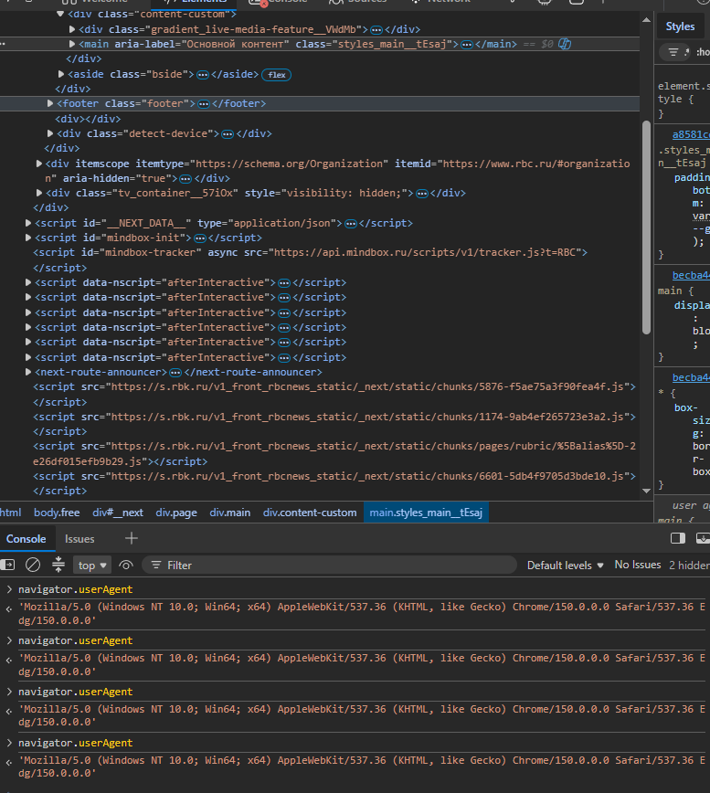
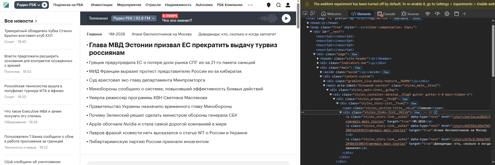
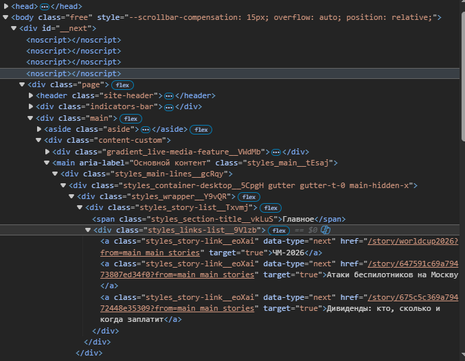
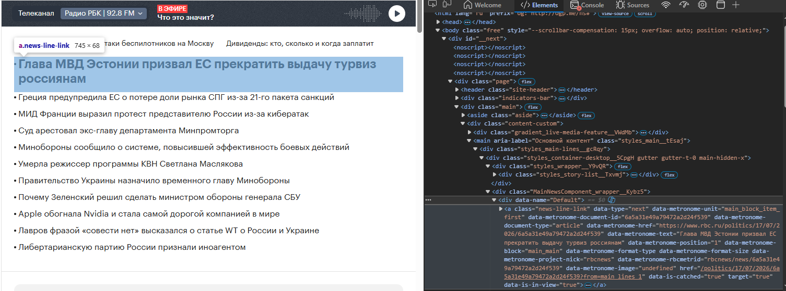
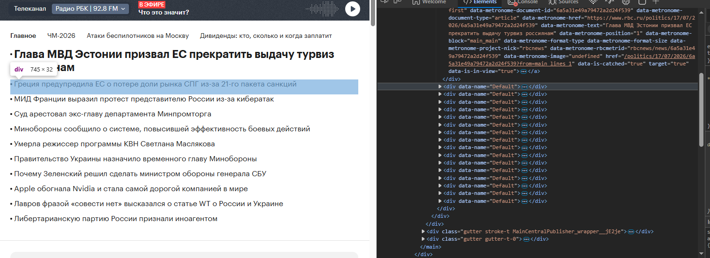
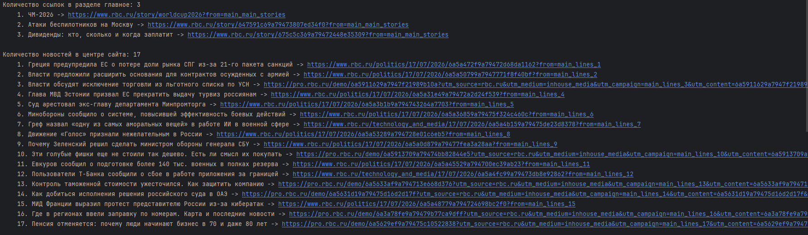
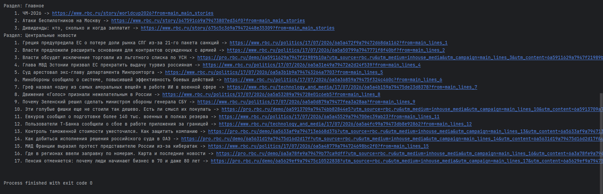

## Задание

Цель: Извлечь заголовки и ссылки на новости с главной страницы новостного сайта.

1. Выберите любой новостной сайт (например, `Lenta.ru`, `RBC.ru`).

2. Используя библиотеку `requests`, получите HTML-содержимое главной страницы.

3. С помощью `BeautifulSoup` найдите все заголовки новостей и соответствующие им ссылки.

4. Выведите найденные заголовки и ссылки в консоль в читаемом формате.

<br>
<br>

---

## Решение

1. Импортируем библиотеки `requests` для получения страница новостного сайта и библиотеку `bs4` для извлечения данных.

```
import requests
from requests import ConnectionError, HTTPError, RequestException, Timeout
from bs4 import BeautifulSoup
```

2. Прописываем `User-Agent` для того, чтобы не блокировали сайта (думаю, что какой-то бот). Прописываем `url` новостного сайта.

```
headers = {
    "User-Agent": "Mozilla/5.0 (Windows NT 10.0; Win64; x64) AppleWebKit/537.36 (KHTML, like Gecko) Chrome/150.0.0.0 Safari/537.36 Edg/150.0.0.0"
}
url = "https://www.rbc.ru"
```

<details>
    <summary>User-Agent</summary>
    <br>
    
</details>

3. Используем конструкцию `try-except` для работы правильной обработки исключений.

    * Используем исключения (ConnectionError, HTTPError, RequestException, Timeout).

    * `HTTPError` = статус-код при возникновении ошибки.

    * `ConnectionError` = ошибка подключения (нет интернета, сервер отклонил подключение на транспортном уровне протокола `TCP/IP`).

    * `RequestException` = ошибка библиотеки.

    * `Timeout` = время ожидания ответа вышло.

    * `requests.get(url)` = получаем страничку. 

    * `response.raise_for_status` = вызывает `HTTPError`, если статус-код указывает на ошибку клиента или сервера.

    * `timeout` = устанавливает максимальное время ожидания ответа = измеряется в секундах.

    * `headers` = для применения заголовка `User-Agent`.

```
try:
    response = requests.get(url, headers=headers, timeout=5)
    response.raise_for_status()
except HTTPError as http_err:
    print(f"Статус-код HTTP: {http_err}")
except ConnectionError as conn_err:
    print(f"Ошибка соединения: {conn_err}")
except Timeout as t_err:
    print(f"Таймаут истёк: {t_err}")
except RequestException as req_err:
    print(f"Ошибка библиотеки requests: {req_err}")
except Exception as e:
    print(f"Другая ошибка: {e}")
```

4. Если исключения не возникнет, то интерпретатор пойдёт смотреть блок `else`.

5. Создаём объект `BeuatifulSoup` для парсинга: достаём `HTML-содержимое` с помощью `response.text` и указываем используем парсер `lxml`.

```
soup = BeautifulSoup(response.text, 'lxml')
```

6. Создадим список `file_arr` для записи его в файл `file.txt`.

```
file_arr = []
```

7. Вначале извлекаем новости из раздела "Главное".

* `soup.select('.styles_links-list__9Vlzb a')` означает, что ищем атрибут `class` с названием `styles_links-list__9Vlzb`, в котором есть ссылки (тег `a`).

* `link.get("href", "")` безопасное извлечение ссылки, если её нет, то подставит "".

* `link.text.strip()` = Извлекаем текст из ссылки, удаляет отступы, табы, ...

* `.find("https://") == 0` = если начинается, то return 0, иначе -1 (склеиваем ссылку).

* `file_arr.append(output_text+"\n")` добавляем все полученные новости в массив для записи в файл.

```
links_main = soup.select('.styles_links-list__9Vlzb a')
    print(f"Количество ссылок в разделе главное: {len(links_main)}")
    file_arr.append(f"Раздел: Главное\n")

    for i, link in enumerate(links_main):
        href = link.get("href", "")
        text = link.text.strip()
        full_url = ""
        if href.find("https://") == 0:
            full_url = href  # print("     ", f"{i+1}. ", link.text.strip(), "->", href)
        else:
            full_url = "https://www.rbc.ru"+href  # print("     ", f"{i+1}. ", link.text.strip(), "->", str("https://www.rbc.ru"+href))
        output_text = f"    {i + 1}. {text} -> {full_url}"
        print(output_text)
        file_arr.append(output_text+"\n")
```

<details>
    <summary>Раздел "Главное"</summary>
    <br>
    
    <br>
    
</details>

8. Извлекаем новости по центру.

* `soup.select('.MainNewsComponent_wrapper__Kybz5 a')` означает, что ищем атрибут `class` с названием `MainNewsComponent_wrapper__Kybz5`, в котором есть ссылки (тег `a`).

* `link.get("href", "")` безопасное извлечение ссылки, если её нет, то подставит "".

* `link.get("data-metronome-text")` = Извлекаем текст из ссылки по атрибуту `data-metronome-text`.

* `.find("https://") == 0` = если начинается, то return 0, иначе -1 (склеиваем ссылку).

* `file_arr.append(output_text+"\n")` добавляем все полученные новости в массив для записи в файл.

```
links_main_center = soup.select('.MainNewsComponent_wrapper__Kybz5 a')
file_arr.append(f"Раздел: Центральные новости\n")
print(f"\nКоличество новостей в центре сайта: {len(links_main_center)}")

for i, link in enumerate(links_main_center):
   href = link.get("href", "")  # Безопасное извлечение, в случае отсутствия атрибута href выведет default.
   text = link.get("data-metronome-text")
   full_url = ""
   if href.find("https://") == 0:
      full_url = href  # print("     ", f"{i+1}. ", link.get("data-metronome-text"), "->", href)
   else:
      full_url = "https://www.rbc.ru"+href  # print("     ", f"{i+1}. ", link.get("data-metronome-text"), "->", str("https://www.rbc.ru"+href))
   output_text = f"    {i + 1}. {text} -> {full_url}"
   print(output_text)
   file_arr.append(output_text+"\n")
```

<details>
    <summary>Раздел "Новости по центру"</summary>
    <br>
    
    <br>
    
</details>

9. Запись и чтение в файл `file.txt`.

* `"file.txt"` = название.

* `"w"` = запись.

* `"r"` = чтение.

* `newline=""` = гарантирует, что перенос строки символ `\n`.

* `encoding="utf-8"` = кодировка файла.

```
with open("file.txt", "w", newline="", encoding="utf-8") as f:
   f.writelines(file_arr)
with open("file.txt", "r", encoding="utf-8") as f:
   print(f"\n{f.read()}")
```

<details>
    <summary>file.txt</summary>
    <br>
    
</details>

<br>
<br>

---

## Полный код

```
import requests
from requests import ConnectionError, HTTPError, RequestException, Timeout
from bs4 import BeautifulSoup

headers = {
    "User-Agent": "Mozilla/5.0 (Windows NT 10.0; Win64; x64) AppleWebKit/537.36 (KHTML, like Gecko) Chrome/150.0.0.0 Safari/537.36 Edg/150.0.0.0"
}
url = "https://www.rbc.ru"

try:
    response = requests.get(url, headers=headers, timeout=5)
    response.raise_for_status()
except HTTPError as http_err:
    print(f"Статус-код HTTP: {http_err}")
except ConnectionError as conn_err:
    print(f"Ошибка соединения: {conn_err}")
except RequestException as req_err:
    print(f"Ошибка библиотеки requests: {req_err}")
except Exception as e:
    print(f"Другая ошибка: {e}")
else:
    soup = BeautifulSoup(response.text, 'lxml')

    file_arr = []
    links_main = soup.select('.styles_links-list__9Vlzb a')
    print(f"Количество ссылок в разделе главное: {len(links_main)}")
    file_arr.append(f"Раздел: Главное\n")

    for i, link in enumerate(links_main):
        href = link.get("href", "")
        text = link.text.strip()
        full_url = ""
        if href.find("https://") == 0:
            full_url = href  # print("     ", f"{i+1}. ", link.text.strip(), "->", href)
        else:
            full_url = "https://www.rbc.ru"+href  # print("     ", f"{i+1}. ", link.text.strip(), "->", str("https://www.rbc.ru"+href))
        output_text = f"    {i + 1}. {text} -> {full_url}"
        print(output_text)
        file_arr.append(output_text+"\n")

    links_main_center = soup.select('.MainNewsComponent_wrapper__Kybz5 a')
    file_arr.append(f"Раздел: Центральные новости\n")
    print(f"\nКоличество новостей в центре сайта: {len(links_main_center)}")

    for i, link in enumerate(links_main_center):
        href = link.get("href", "")
        text = link.get("data-metronome-text")
        full_url = ""
        if href.find("https://") == 0:
            full_url = href  # print("     ", f"{i+1}. ", link.get("data-metronome-text"), "->", href)
        else:
            full_url = "https://www.rbc.ru"+href  # print("     ", f"{i+1}. ", link.get("data-metronome-text"), "->", str("https://www.rbc.ru"+href))
        output_text = f"    {i + 1}. {text} -> {full_url}"
        print(output_text)
        file_arr.append(output_text+"\n")

    with open("file.txt", "w", newline="", encoding="utf-8") as f:
        f.writelines(file_arr)
    with open("file.txt", "r", encoding="utf-8") as f:
        print(f"\n{f.read()}")

```

<details>
    <summary>console</summary>
    <br>
    
    <br>
    
</details>
