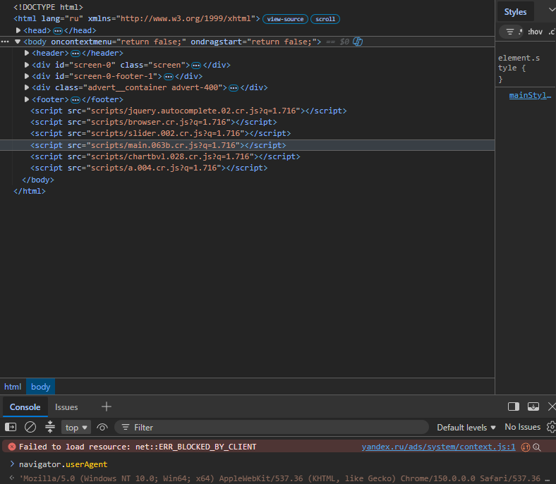
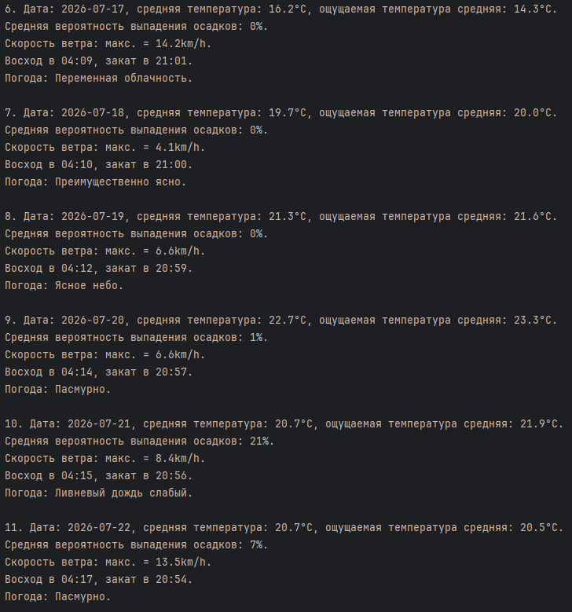
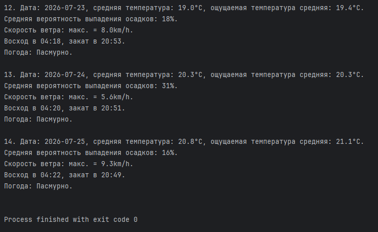

## Задание

### Цель: Получить текущие данные о погоде для заданного города с использованием публичного API.

1. Используем сайт Open-meteo.

2. Изучите документацию к API для получения погоды: `https://open-meteo.com/en/docs#location_and_time`.

3. Используя библиотеку `requests`, отправьте `GET-запрос` к `API` для получения данных о погоде в вашем городе (или любом другом).

4. Обработайте JSON-ответ и извлеките следующую информацию:

    * Температура (в градусах Цельсия)
    
    * Описание погоды (например, "ясно", "небольшая облачность")
    
    * Вероятность выпадения осадков
    
    * Скорость ветра
    
    * Восход
    
    * Закат

<br>
<br>

---

## Решение

1) Импортируем библиотеку `requests`:

```
import requests
from requests import ConnectionError, HTTPError, RequestException, Timeout
```

2) Прописываем useragent через браузер (режим "Режим разработчика" = `F12`), в консоли прописываем `navigator.userAgent`. Указываем формат данных для работы `JSON`.

* `Accept: application/json` указывает, какой формат данных хотим получить от сервера. В данном случае получаем не просто текст или картинка, а структурированный поток данных в формате `JSON`, который должен быть обработан парсером (указывается какой именно нужен).

* `text/html` = текстовое отображение на экране.

* `image/png` = графические файлы.

* `audio/mpeg` = звуковые файлы.

* `application/json`, `application/xml` = структурированные данные для программ. `JSON` имеет жёсткий синтаксис, поэтому относится к категории приложений.

* `Content-type: application/json` = какой формат данных отправляет на сервер.

```
headers = {
    "Accept": "application/json",
    "User-Agent": "Mozilla/5.0 (Windows NT 10.0; Win64; x64) AppleWebKit/537.36 (KHTML, like Gecko) Chrome/150.0.0.0 Safari/537.36 Edg/150.0.0.0"
}
```

<details>
    <summary>User-Agent</summary>
    <br>
    
</details>

3) Используя API-документацию `https://open-meteo.com/en/docs#location_and_time` выбираем параметры, которые хотим получить.

* `latitude` = широта.

* `longitude` = долгота.

* `past_days` = прошедшие дни.

* `forecast_days` = следующие прогнозируемые дни.

* `daily` = ежедневные данные:

    * `temperature_2m_mean` = средняя температура.

    * `apparent_temperature_mean` = средняя ощущаемая температура.

    * `precipitation_probability_mean` = средняя вероятность выпадения осадков.

    * `wind_speed_10m_max` = максимальная скорость ветра.

    * `sunrise` = во сколько восход.

    * `sunset` = во сколько закат.

    * `weather_code` = какая погода.

* `timezone` = определяет автоматически по координатам время.

* `current:temperature_2m,apparent_temperature` = текущая погода и ощущаемая.

```
params_moscow = {
    "latitude": 55.7539,
    "longitude": 37.6203,
    "past_days": 7,
    "forecast_days": 7,
    "daily": "temperature_2m_mean,apparent_temperature_mean,precipitation_probability_mean,wind_speed_10m_max,sunrise,sunset,weather_code",
    "timezone": "auto",
    "current": "temperature_2m,apparent_temperature"
```

<details>
    <summary>coordinates</summary>
    <br>
    
    <br>
    
</details>

4) URL для API.

```
url = "https://api.open-meteo.com/v1/forecast"
```

5) Список кодов погоды.

```
wmo = {
    0: "Ясное небо",
    1: "Преимущественно ясно",
    2: "Переменная облачность",
    3: "Пасмурно",
    45: "Туман",
    48: "Осаждающий изморосью туман",
    51: "Морось лёгкая",
    53: "Морось умеренная",
    55: "Морось плотная",
    56: "Замерзающая лёгкая морось",
    57: "Замерзающая плотная морось",
    61: "Дождь слабый",
    63: "Дождь умеренный",
    65: "Дождь сильный",
    66: "Ледяной дождь слабый",
    67: "Ледяной дождь сильный",
    71: "Снегопад сильный",
    73: "Снегопад умеренный",
    75: "Снегопад сильный",
    77: "Снежные зёрна",
    80: "Ливневый дождь слабый",
    81: "Ливневый дождь умеренный",
    82: "Ливневый дождь шквалистый",
    85: "Ливневый снегопад слабый",
    86: "Ливневый снегопад сильный",
    95: "Гроза",
    96: "Гроза со слабым градом",
    99: "Гроза с сильным ветром"
}
```

<details>
    <summary>weather-docs</summary>
    <br>
    
</details>

6) Извлекаем с помощью библиотеки `requests` данные, используя заголовки и параметры. Используем `try-except` для обработки исключений, `else` = если не возникнет ошибок.

* `.raise_for_status()` = в случае возникновения ошибки, задействует прописанные исключения.

* `ConnectionError` = если ошибка в соединение.

* `Timeout` = если превышен лимит времени запроса.

* `HTTPError` = статус-код ошибки.

* `RequestException` = ошибка библиотеки `requests`.

* `Exception` = если возникла другая ошибка, например, синтаксис.

```
try:
    response = requests.get(url, headers=headers, params=params_moscow, timeout=5)
    response.raise_for_status()
except ConnectionError as conn_err:
    print(f"Ошибка соединения: {conn_err}")
except HTTPError as http_err:
    print(f"Статус-код ошибки: {http_err}")
except Timeout as t_err:
    print(f"Таймаут превышен {t_err}")
except RequestException as req_err:
    print(f"Ошибка библиотеки: {req_err}")
except Exception as e:
    print(f"Другая ошибка: {e}")
else:
```

7) Извлекаем `JSON-ответ`:

```
answer = response.json()
```

8) Извлекаем из ключа `current` значения.

```
current = answer['current']
```

9) Выводит текущую погоду `temperature_2m` с единицей измерения `answer['current_units']['temperature_2m']` и ощущаемую.

```
print(f"\nТекущая погода: {current['temperature_2m']}{answer['current_units']['temperature_2m']}")
print(f"Ощущаемая погода: {current['apparent_temperature']}{answer['current_units']['apparent_temperature']}\n")
```

10) Получаем данные по дням.

```
daily = answer['daily']
```

11) Выводим данные по дням: дату, среднюю температуру за день и ощущаемую, среднюю вероятность, время заката и восхода, какая погода.

```
for i in range(len(daily['time'])):
    print(f"{i}. Дата: {daily['time'][i]}, средняя температура: {daily['temperature_2m_mean'][i]}{answer['daily_units']['temperature_2m_mean']}, ощущаемая температура средняя: {daily['apparent_temperature_mean'][i]}{answer['daily_units']['apparent_temperature_mean']}.")
    print(f"Средняя вероятность выпадения осадков: {daily['precipitation_probability_mean'][i]}{answer['daily_units']['precipitation_probability_mean']}.")
    print(f"Скорость ветра: макс. = {daily['wind_speed_10m_max'][i]}{answer['daily_units']['wind_speed_10m_max']}.")
    print(f"Восход в {daily['sunrise'][i].split('T')[-1]}, закат в {daily['sunset'][i].split('T')[-1]}.")
    print(f"Погода: {wmo.get(daily['weather_code'][i], 'Unknown weather')}.\n")
```

<br>
<br>

---

## Полный код

```
import requests
from requests import ConnectionError, HTTPError, RequestException, Timeout

headers = {
    "Accept": "application/json",
    "User-Agent": "Mozilla/5.0 (Windows NT 10.0; Win64; x64) AppleWebKit/537.36 (KHTML, like Gecko) Chrome/150.0.0.0 Safari/537.36 Edg/150.0.0.0"
}
params_moscow = {
    "latitude": 55.7539,  # широта
    "longitude": 37.6203,  # долгота
    "past_days": 7,  # прошедшие дни
    "forecast_days": 7,  # следующие прогнозируемые дни
    "daily": "temperature_2m_mean,apparent_temperature_mean,precipitation_probability_mean,wind_speed_10m_max,sunrise,sunset,weather_code",  # Ежедневные данные
    "timezone": "auto",  # автоматически определяет время по координатам
    "current": "temperature_2m,apparent_temperature"  # температура воздуха на высоте 2 м от земли, ощущаемая температура
}
url = "https://api.open-meteo.com/v1/forecast"
wmo = {
    0: "Ясное небо",
    1: "Преимущественно ясно",
    2: "Переменная облачность",
    3: "Пасмурно",
    45: "Туман",
    48: "Осаждающий изморосью туман",
    51: "Морось лёгкая",
    53: "Морось умеренная",
    55: "Морось плотная",
    56: "Замерзающая лёгкая морось",
    57: "Замерзающая плотная морось",
    61: "Дождь слабый",
    63: "Дождь умеренный",
    65: "Дождь сильный",
    66: "Ледяной дождь слабый",
    67: "Ледяной дождь сильный",
    71: "Снегопад слабый",
    73: "Снегопад умеренный",
    75: "Снегопад сильный",
    77: "Снежные зёрна",
    80: "Ливневый дождь слабый",
    81: "Ливневый дождь умеренный",
    82: "Ливневый дождь шквалистый",
    85: "Ливневый снегопад слабый",
    86: "Ливневый снегопад сильный",
    95: "Гроза",
    96: "Гроза со слабым градом",
    99: "Гроза с сильным ветром"
}

try:
    response = requests.get(url, headers=headers, params=params_moscow, timeout=5)
    response.raise_for_status()
except ConnectionError as conn_err:
    print(f"Ошибка соединения: {conn_err}")
except HTTPError as http_err:
    print(f"Статус-код ошибки: {http_err}")
except Timeout as t_err:
    print(f"Таймаут превышен {t_err}")
except RequestException as req_err:
    print(f"Ошибка библиотеки: {req_err}")
except Exception as e:
    print(f"Другая ошибка: {e}")
else:
    answer = response.json()

    current = answer['current']
    print(f"\nТекущая погода: {current['temperature_2m']}{answer['current_units']['temperature_2m']}")
    print(f"Ощущаемая погода: {current['apparent_temperature']}{answer['current_units']['apparent_temperature']}\n")

    daily = answer['daily']
    for i in range(len(daily['time'])):
        print(f"{i+1}. Дата: {daily['time'][i]}, средняя температура: {daily['temperature_2m_mean'][i]}{answer['daily_units']['temperature_2m_mean']}, ощущаемая температура средняя: {daily['apparent_temperature_mean'][i]}{answer['daily_units']['apparent_temperature_mean']}.")
        print(f"Средняя вероятность выпадения осадков: {daily['precipitation_probability_mean'][i]}{answer['daily_units']['precipitation_probability_mean']}.")
        print(f"Скорость ветра: макс. = {daily['wind_speed_10m_max'][i]}{answer['daily_units']['wind_speed_10m_max']}.")
        print(f"Восход в {daily['sunrise'][i].split('T')[-1]}, закат в {daily['sunset'][i].split('T')[-1]}.")
        print(f"Погода: {wmo.get(daily['weather_code'][i], 'Unknown weather')}.\n")
```

<details>
  <summary>console</summary>
  <br>
  
  <br>
  
  <br>
  
</details>
