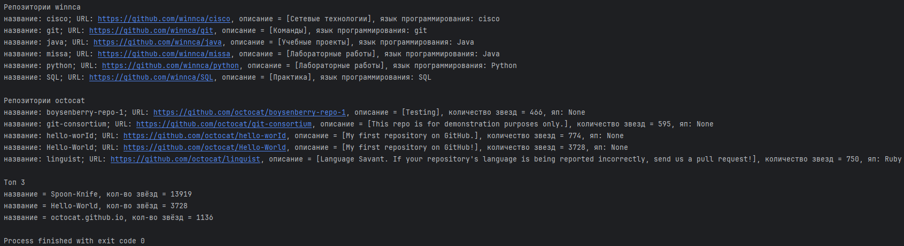
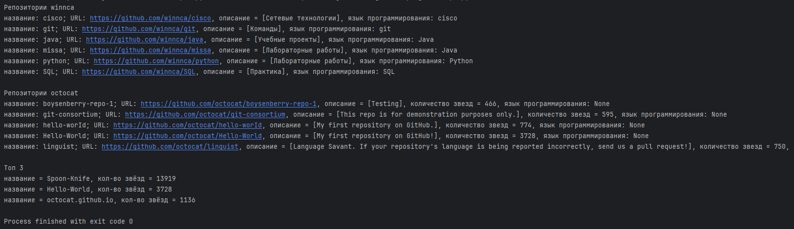
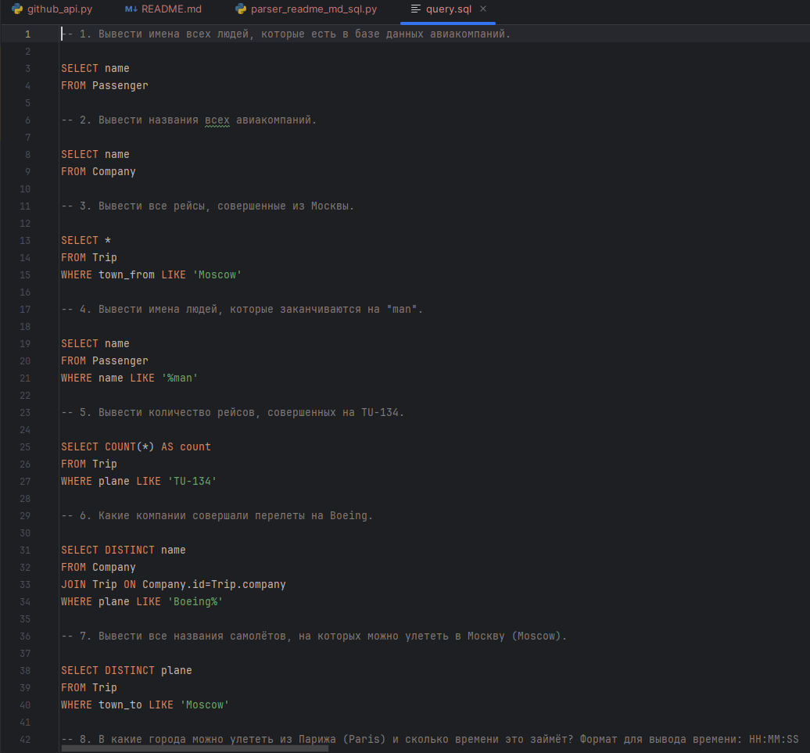
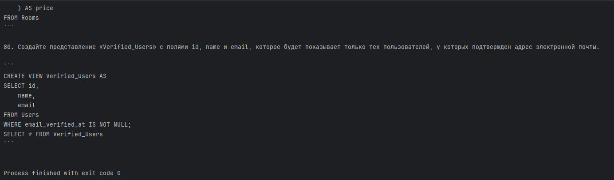

## Содержание

### [Github API](#title0)

### [Парсинг README.md и преобразование в файл query.sql](#title1)

<br>
<br>

---

### <a id="title0">Github API</a>

<br>

#### Задание

Цель: Получить список публичных репозиториев пользователя `GitHub` и информацию о них.

1. Используя библиотеку `requests`, отправьте `GET-запрос` к `GitHub API` для получения списка публичных репозиториев для заданного пользователя
(например, `octocat`). Эндпоинт: https://api.github.com/users/{username}/repos

2. Обработайте JSON-ответ и для каждого репозитория извлеките:

* Название репозитория (`name`)

* URL репозитория (`html_url`)

* Описание (`description`)

* Количество звезд (`stargazers_count`)

* Язык программирования (`language`)

3. Выведите информацию о первых 5 репозиториях в консоль.

4. (Дополнительно) Отсортируйте репозитории по количеству звезд в убывающем порядке и выведите топ-3.

5. (Дополнительно) Используйте сессии `requests.Session()` для выполнения запросов к `GitHub API`.

<br>

#### Решение

1) Импортируем библиотеку `requests`:

```
import requests
from requests import ConnectionError, HTTPError, RequestException, Timeout
```

2) Прописываем useragent через браузер (режим "Режим разработчика" = `F12`), в консоли прописываем `navigator.userAgent`. Указываем формат данных для работы `JSON`.

* `Accept: application/json` указывает, какой формат данных хотим получить от сервера. В данном случае получаем не просто текст или картинка, а структурированный поток данных в формате `JSON`, который должен быть обработан парсером (указывается какой именно нужен).

* для `Github` лучше `application/vnd.github+json` = тоже самое, но можно управлять версиями = менять структуру `JSON-ответов` без поломки старого кода, привязывая к старой `API`.

```
headers = {
    "Accept": "application/json",
    "User-Agent": "Mozilla/5.0 (Windows NT 10.0; Win64; x64) AppleWebKit/537.36 (KHTML, like Gecko) Chrome/150.0.0.0 Safari/537.36 Edg/150.0.0.0"
}
```

3) `URL` для `API`.

```
url = "https://api.github.com/users/winnca/repos"
url = "https://api.github.com/users/octocat/repos"
```

4) Используем объект `Session`. Чтобы сессия автоматически закрывалась используем конструкцию `with`. Используем для установки заголовков на постоянку:

```
with requests.Session() as session:
    session.headers.update(headers)
```

5) Вместо классического запроса `GET` через библиотеку `requests`, используем сессию и таймаут в 5 сек. `raise_for_status()` для обработки исключений, пробросит на нужный `except`. `.json()` получаем `JSON-ответ`:

```
response_winnca = session.get(url, timeout=5)
response_winnca.raise_for_status()
repos_winnca = response_winnca.json()
```

6) Прописываем исключения: `ConnectionError` для ошибки в соединение, `HTTPError` для статус-кода (ошибка на клиенте или сервере), `Timeout` если превысит таймаут, `RquestException` для ошибок с библиотекой `requests`:

```
try:
    response_winnca = session.get(url, timeout=5)
    response_winnca.raise_for_status()
    repos_winnca = response_winnca.json()
except HTTPError as http_err:
    print(f"Статус-код HTTP: {http_err}")
except ConnectionError as conn_err:
    print(f"Ошибка соединения: {conn_err}")
except Timeout as t_err:
    print(f"Таймаут истёк: {t_err}")
except RequestException as req_err:
    print(f"Ошибка библиотеки requests: {req_err}")
except Exception as e:
    print(f"Другая ошибка: {e}")
else:
```

7) Получаем логин пользователя, выводим название репозитория, `URL`, описание, язык программирования для одного профиля.

```
print(f"Репозитории {repos_winnca[0]['owner']['login']}")
for rep in repos_winnca:
    if rep['name'] == 'cisco':
        rep['language'] = 'cisco'
    elif rep['name'] == 'git':
        rep['language'] = 'git'
    elif rep['name'] == 'SQL':
        rep['language'] = 'SQL'
    print(f"название: {rep['name']}; URL: {rep['html_url']}, описание = [{rep['description']}], язык программирования: {rep['language']}")
```

8) Для другого пользователя добавим ещё количество звёзд.

```
url = "https://api.github.com/users/octocat/repos"
try:
    response_octocat = session.get(url, timeout=5)
    response_octocat.raise_for_status()
    repos_octocat = response_octocat.json()
except HTTPError as http_err:
    print(f"Статус-код HTTP: {http_err}")
except ConnectionError as conn_err:
    print(f"Ошибка соединения: {conn_err}")
except Timeout as t_err:
    print(f"Таймаут истёк: {t_err}")
except RequestException as req_err:
    print(f"Ошибка библиотеки requests: {req_err}")
except Exception as e:
    print(f"Другая ошибка: {e}")
else:
    print(f"\nРепозитории {repos_octocat[0]['owner']['login']}")
    for rep in repos_octocat[:5]:
        print(f"название: {rep['name']}; URL: {rep['html_url']}, описание = [{rep['description']}], количество звезд = {rep['stargazers_count']}, язык программирования: {rep['language']}")

    repos_octocat_order_asc = sorted(repos_octocat, key=lambda r: r['stargazers_count'] or 0)  # or 0 на случай, если GitHub вернет None вместо числа звезд
    print("\nТоп 3")
    for rep in repos_octocat_order_asc[::-1][:3]:
        print(f"название = {rep['name']}, кол-во звёзд = {rep['stargazers_count']}")
```

9) Полный код:

```
import requests
from requests import HTTPError, RequestException, ConnectionError, Timeout

headers = {
    "Accept": "application/json",
    "User-Agent": "Mozilla/5.0 (Windows NT 10.0; Win64; x64) AppleWebKit/537.36 (KHTML, like Gecko) Chrome/150.0.0.0 Safari/537.36 Edg/150.0.0.0"
}

with requests.Session() as session:
    session.headers.update(headers)
    url = "https://api.github.com/users/winnca/repos"
    try:
        response_winnca = session.get(url, timeout=5)
        response_winnca.raise_for_status()
        repos_winnca = response_winnca.json()
    except HTTPError as http_err:
        print(f"Статус-код HTTP: {http_err}")
    except ConnectionError as conn_err:
        print(f"Ошибка соединения: {conn_err}")
    except Timeout as t_err:
        print(f"Таймаут истёк: {t_err}")
    except RequestException as req_err:
        print(f"Ошибка библиотеки requests: {req_err}")
    except Exception as e:
        print(f"Другая ошибка: {e}")
    else:
        print(f"Репозитории {repos_winnca[0]['owner']['login']}")
        for rep in repos_winnca:
            if rep['name'] == 'cisco':
                rep['language'] = 'cisco'
            elif rep['name'] == 'git':
                rep['language'] = 'git'
            elif rep['name'] == 'SQL':
                rep['language'] = 'SQL'
            print(f"название: {rep['name']}; URL: {rep['html_url']}, описание = [{rep['description']}], язык программирования: {rep['language']}")

    url = "https://api.github.com/users/octocat/repos"
    try:
        response_octocat = session.get(url, timeout=5)
        response_octocat.raise_for_status()
        repos_octocat = response_octocat.json()
    except HTTPError as http_err:
        print(f"Статус-код HTTP: {http_err}")
    except ConnectionError as conn_err:
        print(f"Ошибка соединения: {conn_err}")
    except Timeout as t_err:
        print(f"Таймаут истёк: {t_err}")
    except RequestException as req_err:
        print(f"Ошибка библиотеки requests: {req_err}")
    except Exception as e:
        print(f"Другая ошибка: {e}")
    else:
        print(f"\nРепозитории {repos_octocat[0]['owner']['login']}")
        for rep in repos_octocat[:5]:
            print(f"название: {rep['name']}; URL: {rep['html_url']}, описание = [{rep['description']}], количество звезд = {rep['stargazers_count']}, язык программирования: {rep['language']}")

        repos_octocat_order_asc = sorted(repos_octocat, key=lambda r: r['stargazers_count'] or 0)  # or 0 на случай, если GitHub вернет None вместо числа звезд
        print("\nТоп 3")
        for rep in repos_octocat_order_asc[::-1][:3]:
            print(f"название = {rep['name']}, кол-во звёзд = {rep['stargazers_count']}")

```

<details>
    <summary>console</summary>
    <br>
    
    <br>
    
</details>

<br>
<br>

---

### <a id="title1">Парсинг README.md и преобразование в файл .sql</a>

#### Задание

1) Пропарсить `README.md` с `https://raw.githubusercontent.com/winnca/SQL/main/README.md`, содержащий `SQL-скрипты

2) Отпарсинный файл с `query.sql`

#### Решение

1) Импортируем библиотеку `requests`:

```
import requests
from requests import ConnectionError, HTTPError, RequestException, Timeout
```

2) Прописываем useragent через браузер (режим "Режим разработчика" = `F12`), в консоли прописываем `navigator.userAgent`. Указываем формат данных для работы `JSON`.

* `Accept: application/json` указывает, какой формат данных хотим получить от сервера. В данном случае получаем не просто текст или картинка, а структурированный поток данных в формате `JSON`, который должен быть обработан парсером (указывается какой именно нужен).

* для `Github` лучше `application/vnd.github+json` = тоже самое, но можно управлять версиями = менять структуру `JSON-ответов` без поломки старого кода, привязывая к старой `API`.

```
headers = {
    "Accept": "application/json",
    "User-Agent": "Mozilla/5.0 (Windows NT 10.0; Win64; x64) AppleWebKit/537.36 (KHTML, like Gecko) Chrome/150.0.0.0 Safari/537.36 Edg/150.0.0.0"
}
```

3) `URL` для парсинга.

```
url = "https://raw.githubusercontent.com/winnca/SQL/main/README.md"
```

4) Извлекаем с помощью библиотеки `requests` данные, используя заголовки и параметры. Используем `try-except` для обработки исключений, `else` = если не возникнет ошибок.

* `.raise_for_status()` = в случае возникновения ошибки, задействует прописанные исключения.

* `ConnectionError` = если ошибка в соединение.

* `Timeout` = если превышен лимит времени запроса.

* `HTTPError` = статус-код ошибки.

* `RequestException` = ошибка библиотеки `requests`.

* `Exception` = если возникла другая ошибка, например, синтаксис.

* `BeautifulSoup(response_winnca.text, 'lxml')` = создаём объект `BeautifulSoup` извлекаем ответ в формате с применением парсера `lxml`.

```
try:
    response_winnca = requests.get(url, headers=headers, timeout=5)
    response_winnca.raise_for_status()
    soup = BeautifulSoup(response_winnca.text, 'lxml')
except HTTPError as http_err:
    print(f"Статус-код HTTP: {http_err}")
except ConnectionError as conn_err:
    print(f"Ошибка соединения: {conn_err}")
except Timeout as t_err:
    print(f"Таймаут истёк: {t_err}")
except RequestException as req_err:
    print(f"Ошибка библиотеки requests: {req_err}")
except Exception as e:
    print(f"Другая ошибка: {e}")
else:
```

5) Выводим полученное и сплитим строку (превращая в список по переносу строки). Создаём список для добавления отпарсенного в файл.

```
print(soup.text)
soup = soup.text.split("\n")
file_arr = []
```

6) Проходимся по списку: 

* Вначале удаляемый по краям отступы и табы для строчки в списке

* Затем проверяем ли пустая ли.

* Проверяем число ли, если да, то делаем комментарием в `SQL`.

* Проверяем строку на (не нужно лишнее в запросе):

    * оставшееся от тега `<summary>`.

    * заголовки `#`, также для кода и комментариев (`>`).

* Добавляем строку в список.

```
for row in answer:
    cl_row = row.strip()
    if not cl_row:  # Для пустых строк
        continue
    if cl_row[0].isnumeric():
        file_arr.append("\n" + "-- " + row + "\n" + "\n")
        continue
    if cl_row[0:3] == "```" or cl_row == "table" or cl_row[0] == ">" or cl_row == "ERD" or cl_row[0] == "#":
        continue
    file_arr.append(row+"\n")
```

7) Записываем список в файл:

```
with open('query.sql', 'w', newline="", encoding='utf-8') as f:
    f.writelines(file_arr)
```

8) Полный код:

```
import requests
from requests import ConnectionError, HTTPError, RequestException, Timeout
from bs4 import BeautifulSoup

headers = {
    "Accept": "application/json",
    "User-Agent": "Mozilla/5.0 (Windows NT 10.0; Win64; x64) AppleWebKit/537.36 (KHTML, like Gecko) Chrome/150.0.0.0 Safari/537.36 Edg/150.0.0.0"
}

url = "https://raw.githubusercontent.com/winnca/SQL/main/README.md"

try:
    response_winnca = requests.get(url, headers=headers, timeout=5)
    response_winnca.raise_for_status()
    soup = BeautifulSoup(response_winnca.text, 'lxml')
except HTTPError as http_err:
    print(f"Статус-код HTTP: {http_err}")
except ConnectionError as conn_err:
    print(f"Ошибка соединения: {conn_err}")
except Timeout as t_err:
    print(f"Таймаут истёк: {t_err}")
except RequestException as req_err:
    print(f"Ошибка библиотеки requests: {req_err}")
except Exception as e:
    print(f"Другая ошибка: {e}")
else:
    print(soup.text)
    soup = soup.text.split("\n")
    file_arr = []
    for row in soup:
        cl_row = row.strip()
        if not cl_row:  # Для пустых строк
            continue
        if cl_row[0].isnumeric():
            file_arr.append("\n" + "-- " + row + "\n" + "\n")
            continue
        if cl_row[0:3] == "```" or cl_row == "table" or cl_row[0] == ">" or cl_row == "ERD" or cl_row[0] == "#":
            continue
        file_arr.append(row+"\n")
    with open('query.sql', 'w', newline="", encoding='utf-8') as f:
        f.writelines(file_arr)
```

<details>
    <summary>console</summary>
    <br>
    
    <br>
    
</details>