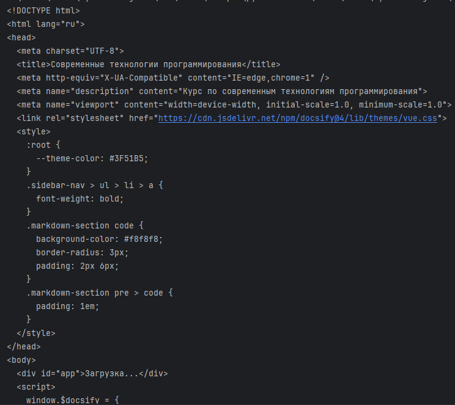
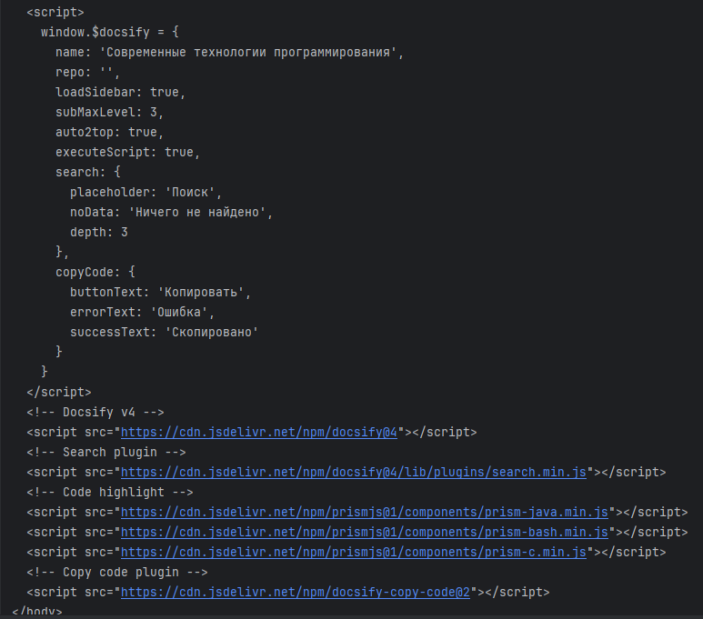
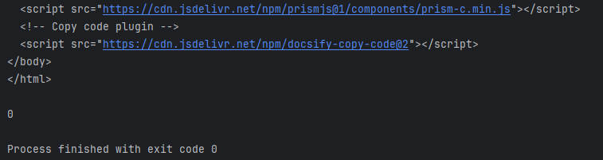
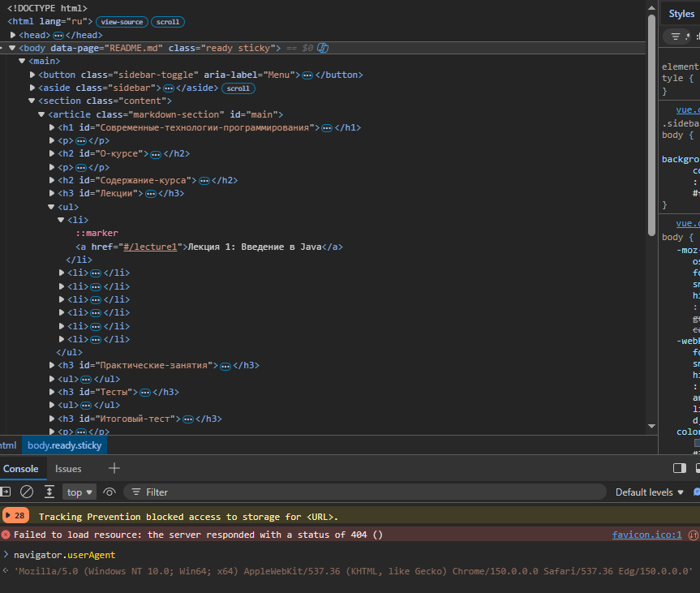
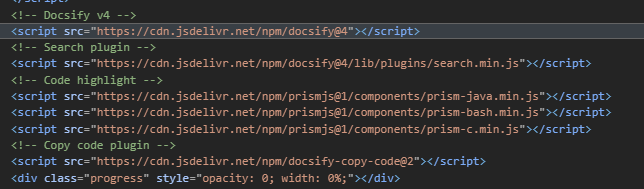
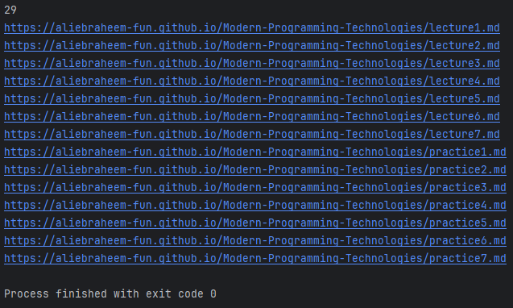
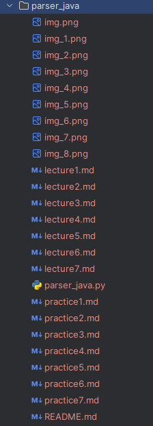

## Содержание

* ### [Задание](#title0)

* ### [Решение](#title1)

<br>
<br>

---

### <a id="title0">Задание</a>

1) Извлечь все лекции и практические занятия с сайта (https://aliebraheem-fun.github.io/Modern-Programming-Technologies/#/).

2) Сохранить в `.md`. Использовать `requests`, `bs4`, `markdown`, `urllib`.

<br>
<br>

---

### <a id="title1">Решение</a>

Импортируем `requests` для `HTTP-запросов` и `BeautifulSoup` для парсинга полученных страниц.

```
import requests
from bs4 import BeautifulSoup
```

1) Вариант с `BeautifulSoup` не подходит из-за того, что целевой сайт собран с помощью документации `Docsify`.

Можно в этом убедиться с помощью кода:

* `headers` используем `User-Agent`, чтобы сайт не блокировал доступ, распознавая, как бота. Заходим на страницу сайта, нажимаем `F12` в консоли вводим `navigator.userAgent`.

* `url` прописываем.

* `.get()` делаем запрос, выставляем `timeout` 5 секунд ожидания перед следующим запросом.

* `.raise_for_status()` = выбросит исключение в случае ошибки.

* `reponse.text` = выводит содержимое того, что видели в режиме `F12`.

* `BeautifulSoup()` = создаём объект bs4 для парсинга, вставляем аргументы: содержимое и парсер.

* `.select()` = с помощью селектора прописываем конкретный путь до ссылок (скриншот).

* `.get('href')` = по атрибуту `href` получаем ссылки.

```
import requests
from bs4 import BeautifulSoup

headers = {
    "User-Agent": "Mozilla/5.0 (Windows NT 10.0; Win64; x64) AppleWebKit/537.36 (KHTML, like Gecko) Chrome/150.0.0.0 Safari/537.36 Edg/150.0.0.0"
}

url = "https://aliebraheem-fun.github.io/Modern-Programming-Technologies/#/"

response = requests.get(url, headers=headers, timeout=5)
response.raise_for_status()
print(response.text)
soup = BeautifulSoup(response.text, 'lxml')

all_links = soup.select('.ready.sticky.content.markdown-section ul a')
print(len(all_links))
for link in all_links:
    print(link.get('href'))
```

<details>
    <summary>console</summary>
    <br>
    
    <br>
    
    <br>
    
</details>

<details>
    <summary>F12 browser</summary>
    <br>
    
    <br>
    
</details>

2) Так как здесь используется `Docsify` = генератор сайтов для документации. Из-за него не видим содержимое тега `body` полностью, точнее `div`, в котором только слова загрузки.

   * То есть, когда переходим на главную страницу и нажимаем на лекцию 1, срабатывает `Javscript-скрипт Docsify`. Понимает, что пользователь хочет `JS` делает запрос и выводит на экран (вставит в `body`).

   * `_sidebar.md` = конфигурационный файл, который содержит в себе все ссылки лекций, семинаров и так далее. 

3) Используем `urllib`. Будем с помощью метода `urljoin` объединять базовый адрес + относительный путь (если `URL` составлена синтаксически неверно, то исправит).

```
from urllib.parse import urljoin
```

4) Понадобится `markdown` библиотека и метод `markdown`, чтобы пропарсить в понятный парсеру `lxml` содержимое.

* `markdown` синтаксис конвертируется в `HTML`.

```
import markdown
```

5) Формируем `url` с помощью `urljoin()`:

```
url = "https://aliebraheem-fun.github.io/Modern-Programming-Technologies/"
url_s = urljoin(url, '_sidebar.md')
```

6) Используем конструкцию `try-except` для работы правильной обработки исключений.

    * Используем исключения (ConnectionError, HTTPError, RequestException, Timeout).

    * `HTTPError` = статус-код при возникновении ошибки.

    * `ConnectionError` = ошибка подключения (нет интернета, сервер отклонил подключение на транспортном уровне протокола `TCP/IP`).

    * `RequestException` = ошибка библиотеки.

    * `Timeout` = время ожидания ответа вышло.

    * `requests.get(url)` = получаем страничку. 

    * `response.raise_for_status` = вызывает `HTTPError`, если статус-код указывает на ошибку клиента или сервера.

    * `timeout` = устанавливает максимальное время ожидания ответа = измеряется в секундах.

    * `headers` = для применения заголовка `User-Agent`.

```
try:
    response = requests.get(url_s, headers=headers, timeout=5)
    response.raise_for_status()
except HTTPError as http_err:
    print(f"Статус-код HTTP: {http_err}")
except ConnectionError as conn_err:
    print(f"Ошибка соединения: {conn_err}")
except Timeout as t_err:
    print(f"Таймаут истёк: {t_err}")
except RequestException as req_err:
    print(f"Ошибка библиотеки requests: {req_err}")
except Exception as e:
    print(f"Другая ошибка: {e}")
```

7) Задействуется `else`, если не возникло исключений:

```
else:
```

8) Используем метод `markdown`, о котором говорили ранее. После создаём объект `BeautifulSoup` вставляем 2 аргумента: содержимое, обработанное `markdown()` и используемый `lxml`.

```
lxml_parser = markdown.markdown(response.text)
soup = BeautifulSoup(lxml_parser, 'lxml')
```

9) Ищем все ссылки (тег `a`) и выводим сколько их.

```
all_links = soup.find_all('a')
print(len(all_links))
```

10) Проходимcя по всем ссылкам и отбираем только лекции и практические занятие (`lecture`, `practice`).

* склеиваем и получаем путь до каждого эндпоинта.

* делаем запрос по той же схеме и сохраняем в файл с помощью конструкции `with open`:

   * `f"{link.get('href')}"` = указываем название, создаваемого файла.
   
   * `"w"` = режим запись.

   * `encoding='utf-8'` = кодировка.

```
for link in all_links:
  if link.get('href')[0:3] == 'pra' or link.get('href')[0] == 'l':
      # file_url = url+link.get('href')
      file_url = urljoin(url, link.get('href'))
      print(file_url)
      try:
          response_file = requests.get(file_url, headers=headers, timeout=5)
          response_file.raise_for_status()
      except HTTPError as http_err:
          print(f"Статус-код HTTP: {http_err}")
      except ConnectionError as conn_err:
          print(f"Ошибка соединения: {conn_err}")
      except Timeout as t_err:
          print(f"Таймаут истёк: {t_err}")
      except RequestException as req_err:
          print(f"Ошибка библиотеки requests: {req_err}")
      except Exception as e:
          print(f"Другая ошибка: {e}")
      else:
          with open(f"{link.get('href')}", "w", encoding='utf-8') as f:
              f.write(response_file.text)
```

11) Полный код:

```
import requests
import markdown
from bs4 import BeautifulSoup
from urllib.parse import urljoin
from requests import ConnectionError, HTTPError, RequestException, Timeout

headers = {
    "User-Agent": "Mozilla/5.0 (Windows NT 10.0; Win64; x64) AppleWebKit/537.36 (KHTML, like Gecko) Chrome/150.0.0.0 Safari/537.36 Edg/150.0.0.0"
}

url = "https://aliebraheem-fun.github.io/Modern-Programming-Technologies/"
url_s = urljoin(url, '_sidebar.md')
try:
    response = requests.get(url_s, headers=headers, timeout=5)
    response.raise_for_status()
except HTTPError as http_err:
    print(f"Статус-код HTTP: {http_err}")
except ConnectionError as conn_err:
    print(f"Ошибка соединения: {conn_err}")
except Timeout as t_err:
    print(f"Таймаут истёк: {t_err}")
except RequestException as req_err:
    print(f"Ошибка библиотеки requests: {req_err}")
except Exception as e:
    print(f"Другая ошибка: {e}")
else:
    lxml_parser = markdown.markdown(response.text)
    soup = BeautifulSoup(lxml_parser, 'lxml')

    all_links = soup.find_all('a')
    print(len(all_links))
    for link in all_links:
        if link.get('href')[0:3] == 'pra' or link.get('href')[0] == 'l':
            # file_url = url+link.get('href')
            file_url = urljoin(url, link.get('href'))
            print(file_url)
            try:
                response_file = requests.get(file_url, headers=headers, timeout=5)
                response_file.raise_for_status()
            except HTTPError as http_err:
                print(f"Статус-код HTTP: {http_err}")
            except ConnectionError as conn_err:
                print(f"Ошибка соединения: {conn_err}")
            except Timeout as t_err:
                print(f"Таймаут истёк: {t_err}")
            except RequestException as req_err:
                print(f"Ошибка библиотеки requests: {req_err}")
            except Exception as e:
                print(f"Другая ошибка: {e}")
            else:
                with open(f"{link.get('href')}", "w", encoding='utf-8') as f:
                    f.write(response_file.text)
```

<details>
   <summary>console</summary>
   <br>
   
</details>

<details>
   <summary>parser_java</summary>
   <br>
   
</details>