# Содержание

* ### [Теория](#title0)

* ### [Библиотека requests](#title1)

* ### [Библиотека BeautifulSoup](#title2)

* ### [Работа с REST API и форматом JSON](#title3)

<br>
<br>

---

## <a id="title0">Теория</a>

* `HTTP` = `Hypertext Transfer Protocol` = протокол прикладного уровня в модели `TCP/IP` = используется для получения информации с сервера.

1. Методы `HTTP`:

* `GET` = запрос (получение) данных с указанного ресурса (открытие страницы в браузере). 

* `POST` = запрос на создание ресурса с отправкой данные на сервер (форма заполненная).

* `PUT` = запрос на обновление ресурса с отправкой новых данных на сервер.

* `DELETE` = запрос на удаления указанного ресурса.

* `PATCH` = запрос для частичного изменения ресурса.

* `HEAD` = запрос заголовков, как `GET` без тела ответа. Полезно для проверки существования ресурса или его метаданных.

<br>

2. **Идемпотентность** = свойство, при котором многократное отправка 1 и того же запроса приводит к 1 и точно такому же изменению состояния сервера.

* Система не выполнит 1 действие дважды.

* Из-за сбоев в сетях, ответ может не дойти до клиента, пользователь отправляет запрос повторно.

Методы идемпотентные:

* `GET`

* `PUT`

* `DELETE`

* `HEAD`

<br>

**Неидемпотентные** методы:

* `POST` = каждый повторный запрос создаёт новый ресурс, 10 одинаковых запросов создадут 10 записей.

    * Например, добавление комментария. Нажимая несколько раз на кнопку, сервер создаст новый идентичный комментарий предыдущему.

    * Например, регистрация, нажимаем кнопку несколько раз создаст дубликаты пользователя (если там есть ограничения на уникальный `email`, то выдаст ошибку).

* `PATCH` = так как меняет часть ресурса.

  * Например, пополняем счёт, выбираем пополнить на некоторую сумму и нажимаем несколько раз => увеличится настолько же.

Для предотвращения неидемпотентных операций могут использоваться: `Idempotency-Key`:

* Генерирует `UUID` = Universally Unique Identifier = передаёт его в заголовке запроса.

* Сервер перед тем, как выполнить операцию, проверяет, если ключ в кэше.

* Если нет, то сервер выполнит операцию и сохранит результат в кэш на короткое время.

* Если есть, то операция не выполнится.

> Также вместо `PATCH` можно использовать `PUT`.

<br>

**Коды состояния `HTTP`**:

* `1xx` = ***информационные***.

    * запрос получен, процесс продолжается, ответ отправится позже.

    * `100` = получил начальную часть данных, пользователь может отправлять дальше.

    * `101` = сервер соглашается изменить протокол по запросу клиента: с `HTTP` на `WebSocket`.

    * `103` = используется для отправки некоторых заголовков ответа, чтобы ускорить загрузку страницы.

* `2xx` = ***успешные***.

    * `200 OK` = успешный ответ.

    * `201 Created` = запрос выполнен, ресурс новый создан.

    * `204 No content` = запрос выполнен, тело ответа нет (удаление ресурса).

* `3xx` = ***перенаправление***.

    * `301 Moved Permanently` = ресурс был окончательно перемещён.

    * `302 Found` = ресурс временно перемещён.

* `4xx` = ***ошибка клиента***.

    * `400 Bad Request` = некорректный синтаксис запроса.

    * `401 Unauthorized` = требуется аутентификация.

    * `403 Forbidden` = доступ к ресурсу запрещён (даже пройдя аутентификацию).

    * `404 Not Found` = такого ресурс нет.

    * `429 Too Many Requests` = отправили слишком много запросов к сайту.

* `5xx` = ***ошибка сервера***.

    * `500 Internal Server Error` = общая ошибка на сервере.

    * `502 Bad Gateway` = 1 сервер в сети получил неверный ответ от другого сервера (перегрузка, поломка шлюза, ...).

    * `503 Service Unavailable` = сервер не может временно обрабатывать запросы.

<br>
<br>

---

### <a id="title1">Библиотека requests</a>

* Библиотека для выполнения `HTTP-запросов` в `Python`.

<details>
  <summary>pip install requests</summary>
  <br>
  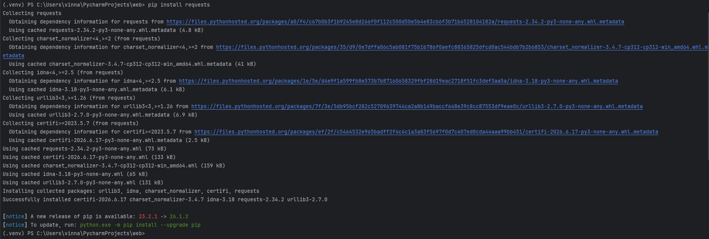
</details>

<br>

1) Простой `GET-запрос`.

* `requests.get(url)` = `GET-запрос` по указанному `URL`.

* `response.status_code` = return статус код `HTTP`.

* `response.encoding` = кодировка содержимого ответа.

* `response.content` = return ответ в байтах (полезно для изображений/файлов = бинарные данные).

* `response.text` = return содержимое ответа в виде строки = удобно для `HTML` и `JSON`.

```
import requests

url = "https://www.google.com"
response = requests.get(url)

print(f"Статус код: {response.status_code}")
print(f"Кодировка ответа: {response.encoding}")
print(f"Размера ответа в байтах: {len(response.content)}")

print("Вывод первых 500 символ HTML-содержимого")
print(response.text[:500])
```

<details>
  <summary>get(url)</summary>
  <br>
  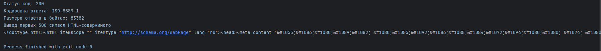
</details>

<br>

2) `GET-запрос` с параметрами.

Словарь `params` автоматически преобразуется в строку запроса и добавляется к `URL`: `https://www.google.com/search?q=Python+requests+library&hl=ru`.

* `?` = разделитель = отделяет путь от параметров.

* `ключ=значение` = данные передаются в виде переменных и значений.

* `&` = разделитель = отделяет параметры между собой.

Парамеры используется:

* поиск (передача поисковой информации).

    * `q/query` = поисковая фраза (`?q=ноутбук`).

* фильтрация (отбор товаров).

    * `cat/category` = категория товара = (`?category=books`).

    * `color` = цвет (`?color=white`).

    * `size` = размер (`?size=M`).

    * `price_from`/`price_to` = диапазон цен = (?price_from=10000000&price_to=500000000).

* сортировка (выбор способа отображения товаров).

    * `sort` = поле для сортировки = `?sort=price`.

    * `order` = направление сортировки (`?order=asc` — по возрастанию, `?order=desc` — по убыванию).

    * `limit` = количество элементов на странице (`?limit=20`).

    * `lang`/`local` = язык интерфейса (`?lang=ru`) (Google/Meta).

    * `hl` = хост-язык (общепринятый).

* пагинация (выдача определённой страницы).

    * `p`/`page` = номер страницы при пагинации (`?page=5`). 

* источник перехода = `UTM-метки` для отслеживания (маркетинг и аналитика).

    * `utm_source` = рекламная площадка (`?utm_source=yandex`).

    * `utm_medium` = тип рекламы (`?utm_medium=cpc`).

    * `utm_campaign` = название рекламной кампании (`?utm_campaign`).

`response.url` = показывает полный `URL`, который был использован, включая параметры.

```
import requests

url = "https://www.google.com/search"
params = {
    "q": "Python requests library",
    "hl": "ru"  # Язык интерфейса
}

response = requests.get(url, params=params)

print(f"{response.url}")
print(f"{response.status_code}")
print(f"{response.text[:500]}")
```

<details>
  <summary>get(url, params=params)</summary>
  <br>
  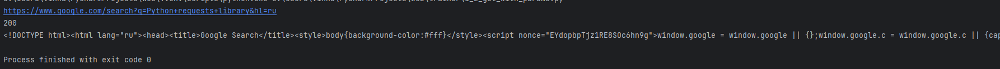
</details>

<br>

3) `POST-запрос`.

* Данные передаются в теле запроса.

* Используем `JSONPlacerholder API` = имитация отправки данных. 

* `requests.post(url, json=data)` = преобразует `python-словарь` в `JSON-строку` и устанавливает заголовок `Content-Type: application/json`.

* `response.json()` = преобразует ответ JSON в python-словарь/список.

```
import requests

url = "https://jsonplaceholder.typicode.com/posts"

data = {
    "title": "foo",
    "body": "bar",
    "userId": 1
}

response = requests.post(url, json=data)

print(f"Статус-код: {response.status_code}")
print("Ответа сервера JSON")
print(response.json())  # преобразует ответ JSON в python-словарь/список
```

<details>
  <summary>https://jsonplaceholder.typicode.com/posts</summary>
  <br>
  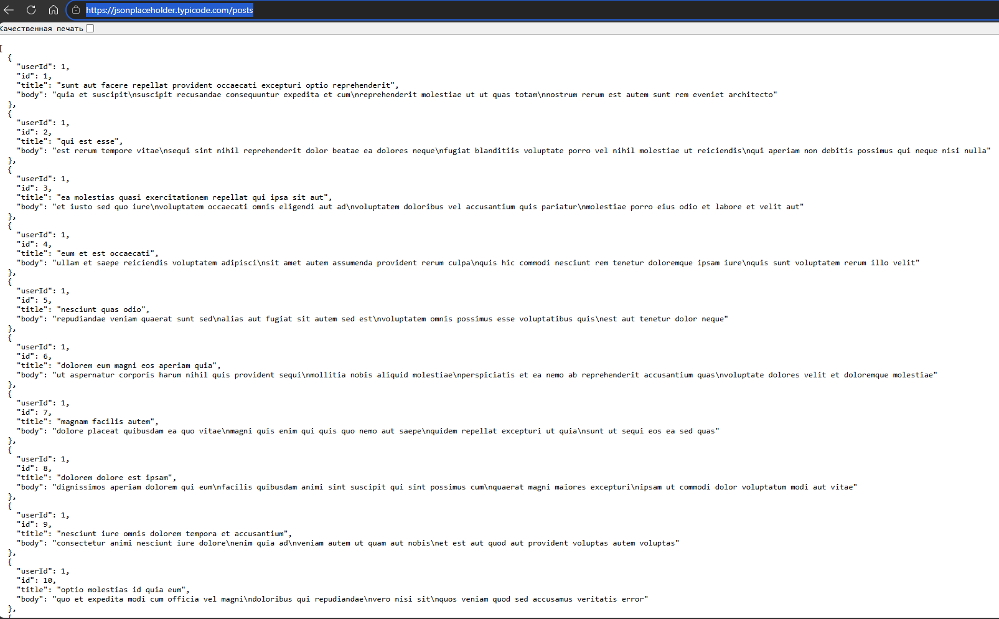
</details>

<details>
  <summary>post(url, json=data)</summary>
  <br>
  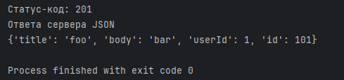
</details>

<br>

4) `POST-запрос` отправка данных в виде формы.

* `post(url, data=data)` = `Content-Type: application/x-www-form-urlencoded`.

```
import requests

url = "https://jsonplaceholder.typicode.com/posts"
data = {
    "title": "foo",
    "body": "bar",
    "UserId": 1
}
response = requests.post(url, data=data)

print(f"Статус-код: {response.status_code}")
print(response.json())
```

<details>
  <summary>post(url, data=data)</summary>
  <br>
  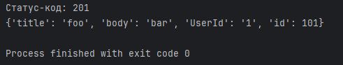
</details>

<br>

5) Заголовки запросов: `Headers`.

* `https://httpbin.org/headers` = для тестирования `HTTP-запросов`.

* `Accept` = список форматов данных, которые готов принять браузер: `HTML`, `XML`, `XHTML` и изображений (`AVIF`, `WebP`, `APNG`), ...

* `Accept-Encoding` = алгоритмы сжатия, которые поддерживает браузер = сжать ответы для экономии трафика = `gzip`, `defalte`, `br`, `zstd`.

* `Accept-Language` = язык пользователя.

* `Host` = доменное имя сервера, которые обращаются сервер.

* `User-Agent` = строка идентификации браузера и ОС = Microsoft Edge version 149 с движком Chromium на Windows 10 64. Использование заголовка, чтобы сайт не блокировал запрос.

* `Priority` = приоритет загрузки данного ресурса: `u=0` - самый высокий, `i` - интерактивным, то есть критически важен для пользователя.

* `Sec-Ch-Ua` = `User-Agent Client Hints` = замена для обычного `User-Agent`, потому что передаётся много лишней информации о компьютере (архитектура процессора, версию ОС, сборку браузера, какие расширения у браузера установлены).

    * `Sec-Ch-Ua` = **Браузер** + **версия** + **движок и версия** + **пустышка для совместимости с другими браузерами**.

    * `'Sec-Ch-Ua-Mobile': '?0'` = запрос отправлен с пк, не с мобильного устройства.

    * `'Sec-Ch-Ua-Platform': '\Windows'` = ОС пользователя.

* `Sec-Fetch` = `Fetch Metadata` = заголовки безопасности = защищают сайты от хакерских атак `CSRF` (подделка запросов) и `XS-Leaks` (утечка данных).

    * `Sec-Fetch-Site` = **откуда** = значение `none` - вбил вручную, `cross-site` = переход с чужого сайта.

    * `Sec-Fetch-Mode` = **как** = способ загрузки = значение `navigate` - обычный переход по ссылке или открытие страницы.

    * `Sec-Fetch-Dest` = **зачем** = какой именно файл нужен браузеру = значение `document` - загрузка веб-страницы.

    * `Sec-Fetch-User` = **кто нажал** = значение `?1` - клик пользователя, не скрипт на странице.

* `'Upgrade-Insecure-Requests': '1'` = **запрос на безопасность** = у клиента предпочтение на зашифрованное соединение `HTTPS`, просьба автоматически перенаправить на защищённую версию сайта.

```
import requests

url = "https://httpbin.org/headers"
headers={
    "User-Agent": "MyPythonApp/1.0",
    "Accept-Language": "ru-RU,ru;q=0.9,en-US;q=0.8,en;q=0.7"
}

response = requests.get(url, headers=headers)

print(response.status_code)
print(response.json())
```

* `200` = статус успешного ответа от сервера.

* `'Accept': '*/*'` = сообщение серверу, что содержимое может быть любым (изображение, `JSON`, `HTML`, ...).

* `'Accept-Encoding': 'gzip, deflate'` = если содержимое ответа слишком большое, то можно `gzip`, `deflate`.

* `'Accept-Language': 'ru-RU,ru;q=0.9,en-US;q=0.8,en;q=0.7'` = перечень языков по приоритетам, которые хотим получить. Поиск погоды, новостей в пределах РФ.

    * `ru-RU` = самый желанный, используется в РФ. У него нет `q` - коэффициент приоритета, поэтому по умолчанию 1.0.
    
    * `ru-BY` = русский язык в Беларуси. Сайт переключит цены на их валюту и покажет местные новости и погоду. 

    * `ru;q=0.9` = русский язык без привязки к региону. Приоритет 0.9. Сервер выберет его, если страница  `ru-Ru` отсутствует.

    * `en-US;q=0.8` = английский язык в США. Если русский недоступен.

    * `en;q=0.7` = английский язык без привязки к региону. Если нет `en-US`.

* `'Host': 'httpbin.org'` = обязательный заголовок = доменное имя сервера = нужно, когда на одном `IP-адресе` несколько сайтов = `requests` добавила его автоматически.

* `'User-Agent': 'MyPythonApp/1.0'` = приложение представилось серверу с именем и версией. Отличают реальных людей и ботов.

* `'X-Amzn-Trace-Id': 'Root=1-6a429935-2648d86f29400eab4927c82a'}` = идентификатор добавился сервер к ответу для служебных нужд (`AWS` облака).

<details>
  <summary>post(url, data=data)</summary>
  <br>
  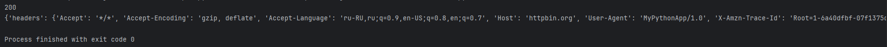
  <br>
  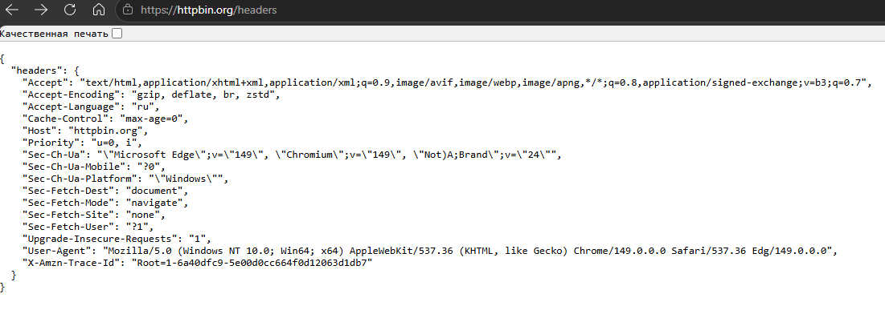
</details>

<br>

```
import requests

url = "https://httpbin.org/headers"
headers = {
    "User-Agent": "MyPythonApp/1.0",
    "Accept-Language": "ru-RU,ru;q=0.9,en-US;q=0.8,en;q=0.7"
}

response = requests.get(url, headers=headers)

# Заголовки клиента
print(response.status_code)
print(response.json())

# Заголовки сервера
response_head = requests.head(url, headers=headers)
print(response_head.status_code)
print(response_head.headers)
```

<details>
  <summary>head(url, headers=headers)</summary>
  <br>
  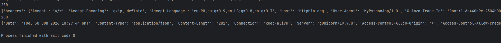
  <br>
  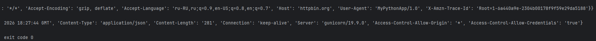
</details>

<br>

6) Обработка исключений:

* `HTTPError` = статус-код при возникновении ошибки.

* `ConnectionError` = ошибка подключения (нет интернета, сервер отклонил подключение на транспортном уровне протокола `TCP/IP`).

* `RequestException` = ошибка библиотеки.

* `Timeout` = время ожидания ответа вышло.

* `response.raise_for_status` = вызывает `HTTPError`, если статус-код указывает на ошибку клиента или сервера.

* `timeout` = устанавливает максимальное время ожидания ответа = измеряется в секундах.

```
import requests
from requests.exceptions import HTTPError, ConnectionError, RequestException, Timeout

url = "https://nonexisting-domain-12345678.com"

try:
    response = requests.get(url, timeout=5)
    response.raise_for_status()
    print("Запрос успешно выполнен")
except HTTPError as http_err:
    print(f"Ошибка HTTP: {http_err}")
except ConnectionError as conn_err:
    print(f"Ошибка соединения: {conn_err}")
except Timeout as t:
    print(f"Таймаут превышен: {t}")
except RequestException as req_err:
    print(f"Ошибка библиотеки requests: {req_err}")
except Exception as e:
    print(f"Другая ошибка: {e}")
else:
    print(f"Содержимое ответа: {response.text[:10]}") # Выполнится, если в блоке try не выкинуло исключения
```

<details>
  <summary>exception</summary>
  <br>
  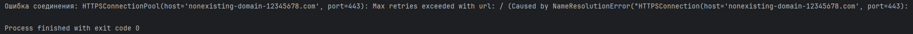
</details>

<br>

7) Сессии.

* `requests.Session()` = создаёт объект сессии.

* `session.headers.update()` = устанавливает заголовки, которые будут автоматически добавляться ко всем запросам, сделанным через сессию.

* `session.cookies` = объект, который автоматически управляет всеми куками.

* `with` = корректное закрытие сессии.

```
import requests

with requests.Session() as session:
    session.headers.update({"User-Agent": "MySessionApp/1.0"})

    # Получаем куки
    response1 = session.get("https://httpbin.org/cookies/set/sessioncookie/12345")
    print(f"Куки после 1-ого запроса: {session.cookies.get('sessioncookie')}")

    # Куки автоматически отправляются
    response2 = session.get("https://httpbin.org/cookies")
    print(f"Куки, отправленные 2-ым запросом: {response2.json()['cookies']}")

    # Параметры по умолчанию (установка)
    session.params.update({"lang": "en"})
    response3 = session.get("https://httpbin.org/get")
    print(f"Параметры, отправленные 3-им запросом: {response3.json()['args']}")
```

<details>
  <summary>session</summary>
  <br>
  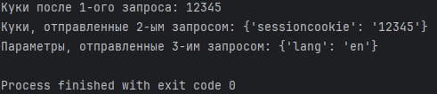
  <br>
  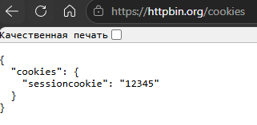
  <br>
  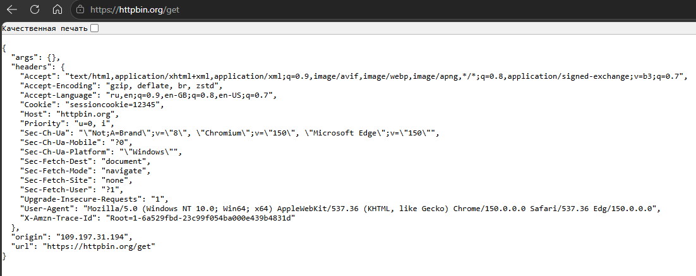
</details>

<br>

8) `HTTP-аутентификация`.

* Аргумент `auth` принимает кортеж `(username, password)` для базовой аутентификации или объект, реализующий интерфейс аутентификации `requests`.

* Библиотека `requests` под капотом автоматически кортеж конвертирует в объект `HTTPBasicAuth`.
```
import requests
from requests.auth import HTTPBasicAuth

url = "https://httpbin.org/basic-auth/user/passwd"

# Метод 1: передача логина и пароля напрямую.
response = requests.get(url, auth=('user', 'passwd'))
print(f"Статус-код с помощью прямой передачи: {response.status_code}")
print(f"Аутентификация успешна: {response.json()['authenticated']}")

# Метод 2: использование объекта HTTPBasicAuth
response = requests.get(url, auth=HTTPBasicAuth('user', 'passwd'))
print(f"Статус-код с помощью BasicAuth: {response.status_code}")
print(f"Аутентификация успешна: {response.json()['authenticated']}")

# Неверные учётные данные
response_fail = requests.get(url, auth=('wrong_user', 'wrong_passwd'))
print(f"Статус-код с неверными данными: {response.status_code}")
```

<details>
  <summary>auth</summary>
  <br>
  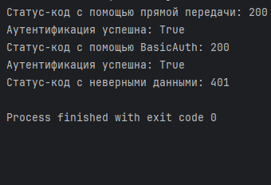
</details>

<br>
<br>

---

## <a id="title2">BeautifulSoup</a>

1. Получение `HTML-страницы`.

2. Разбор страницы = **спарсить**.

Используется библиотека `BeautifulSoup` с 2 парсерами (`lxml`, `html.parser`):
  
  * `lxml` = быстрее, чем `html.parser`. Требует отдельной установки.

  * `html.parser` = встроен в `python`.

<br>

1) Создаём объект `BeautifulSoup`.

* `requests.get(url)` = получение `HTML-страницы`.

* `BeautifulSoup(response.text, 'lxml')` = создаёт парсируемого объекта. `lxml` = парсер, `response.text` = передача `HTML-строки` (строка Python).
  
* `soup.title` = получаем тег `title`.

* `soup.title.string` = содержимое тега `<title>`.

```
import requests
from bs4 import BeautifulSoup

url = "https://www.python.org"
response = requests.get(url)
response.raise_for_status()

soup = BeautifulSoup(response.text, 'lxml')

print(f"Тип объекта: {type(soup)}")
print("\nЗаголовок страницы: ")
print(soup.title)
print(f"Текст заголовка: {soup.title.string}")
```

<details>
  <summary>auth</summary>
  <br>
  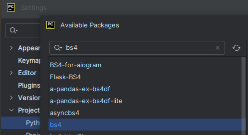
  <br>
  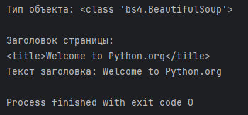
</details>

<br>

### Поиск элементов по тегам, атрибутам, CSS-селекторам, тексту.

1) По тегам: `find()`, `find_all()`.

* `find()` = находит первое вхождение тега.

* `find_all()` = находит все вхождения тега и return список.

* `h1_tag.text` = текст тега `<h1>`.

* `.get('href')` = значение атрибута `href`.

```
import requests
from bs4 import BeautifulSoup

url = "https://www.python.org"
response = requests.get(url)
soup = BeautifulSoup(response.text, 'lxml')

# Находим первый заголовок h1
h1_tag = soup.find('h1')
if h1_tag:
    print(f"Первый h1: {h1_tag.text}")

# Находим все ссылки
all_links = soup.find_all('a')
print(f"Найдены все ссылки: {len(all_links)}")
for link in all_links:
    print(link.get('href'))  # получаем значение по атрибуту href
```

<details>
  <summary>auth</summary>
  <br>
  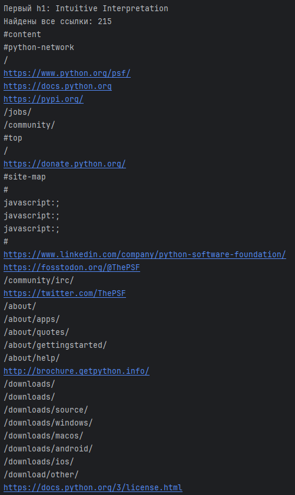
  <br>
  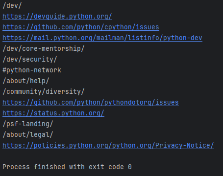
</details>

<br>

2) Поиск по атрибутам.

`find()` и `find_all()` могут принимать словарь с атрибутами для более точного поиска**.

* Тег `<div>` = блочный тег для объединения других тегов по принадлежности (выдумывает разработчик).

    * Аргумент `id` со значением `content` (выдуманное значение разработчиком). Найдёт все значения с данным `id`.

    * Выглядит так: `<div id="content">` (`id` атрибут).

* У `<div>` есть не только `id`, но другие атрибуты, например, `class_` = искать элементы по классам.

    * Класс `tier-1 element-1` (выдуманное название).

* Атрибут `src` = ссылка на ресурс.

* Атрибут `alt` = текстовое описание картинки.

* `.get('src')` = значение атрибута `src`.

```
import requests
from bs4 import BeautifulSoup

url = "https://www.python.org"
response = requests.get(url)
soup = BeautifulSoup(response.text, 'lxml')

# Находим элементы с определённым ID
content_div = soup.find('div', id='content')
if content_div:
    print(f"Найден <div> с id='content': {content_div.text[:50]}")

# Находим все теги <li> (список элементов) с определённым CSS классом 'tier-1 element-1' .
main_nav_items = soup.find_all('li', class_='tier-1 element-1')
print(f"\nНайдено: {len(main_nav_items)} элементов в навигации")
for i, item in enumerate(main_nav_items, 1):
    print(f"--- БЛОК №{i} ---")
    print(item.text.strip())  # Удаляем пробелы и отступы

# Поиск по нескольким атрибутам
python_logo = soup.find('img', src='/static/img/python-logo.png', alt="python™")  # alt = текстовое описание картинки
if python_logo:
    print(f"Найден логотип Python: {python_logo.get('src')}")
```

<details>
  <summary>find(), find_all()</summary>
  <br>
  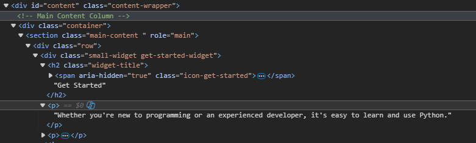
  <br>
  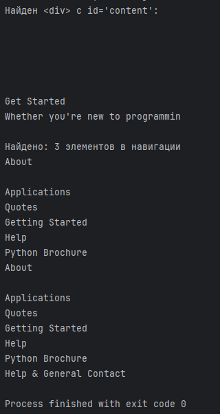
  <br>
  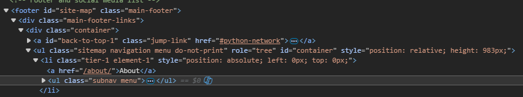
  <br>
  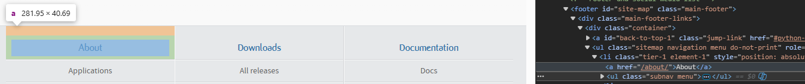
  <br>
  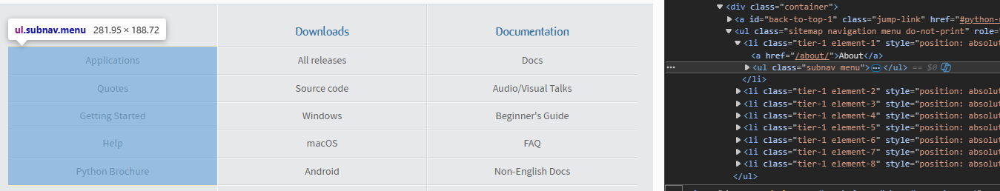
  <br>
  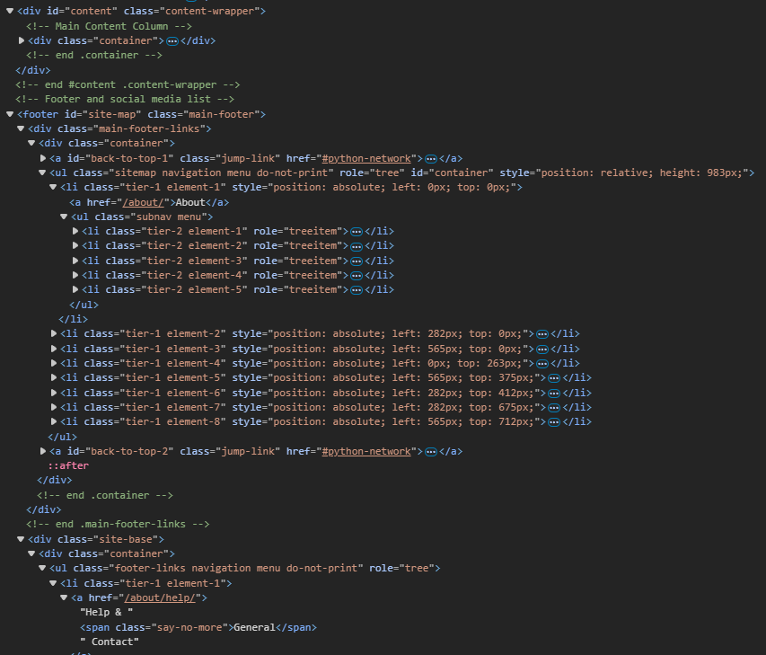
  <br>
  
  <br>
  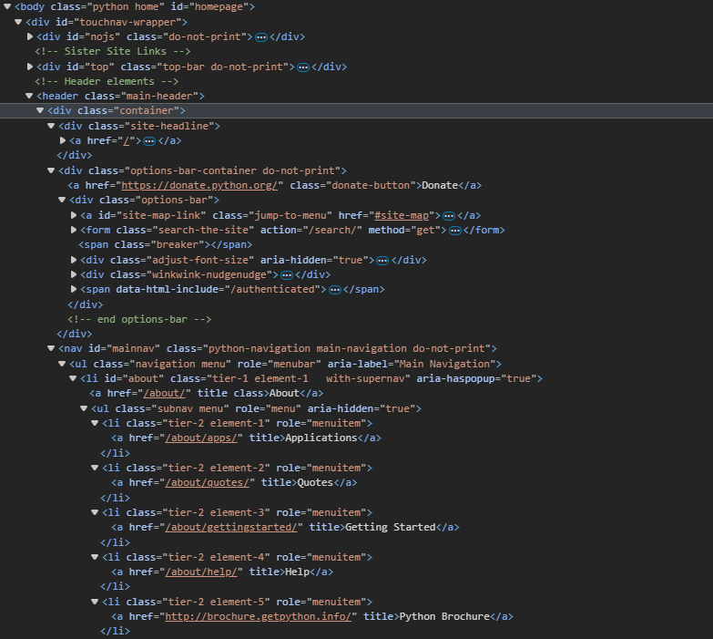
  <br>
  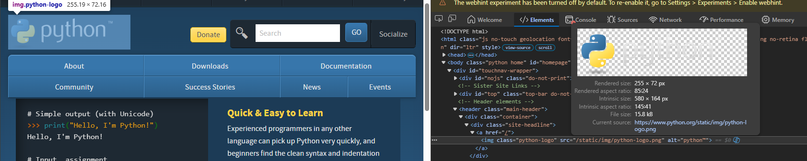
</details>

<br>

3) Поиск по CSS-селекторам.

* `select()` = позволяет искать CSS-селекторы.

* `soup.select('selector')` = return список элементов, соответствующих селектору.

* `soup.select_one('selector')` = return 1-е вхождение элемента, соответствующего селектору.

* `next()` = берёт 1-ую строку, `stripped_string` = берёт строки поочерёдно.

* `#content` = ищет `id` с таким названием.

* `#content a` = все ссылки внутри тега `div` с `id="content"`, с помощью `href` достаём все ссылки.

* `#content p a` = все ссылки внутри тега `div` с `id="content"`, внутри `p`.

* `#content .small-widget a` = все ссылки внутри тега `div` с `id="content"`, внутри тега `small-widget` (содержит несколько классов).

    * `.small-widget.get-started-widget` = конкретный класс.

```
import requests
from bs4 import BeautifulSoup

url = "https://www.python.org"
response = requests.get(url)
soup = BeautifulSoup(response.text, 'lxml')

# Находит все ссылки (тег a в блоке <div> с id="content")
links_in_content = soup.select('#content a')
print(f"Найдено внешних ссылок: {len(links_in_content)}")
for link in links_in_content[:3]:
    print(link.text.strip(), "->", link.get('href'))

# Находит ссылки (внутри тега p в блоке <div> с id="content" с тегом a)
links_in_content_new = soup.select('#content p a')
print(f"\nНайдено ссылок внутри тега p: {len(links_in_content_new)}")
for link in links_in_content_new[:5]:
    print(link.text.strip(), "->", link.get('href'))

# Находит ссылки внутри small_widget
links_in_content_widget = soup.select('#content .small-widget a')
print(f"\nНайдено ссылок внутри class_=small_widget: {len(links_in_content_widget)}")
for link in links_in_content_widget[:4]:
    print(link.text.strip(), "->", link.get('href'))

# Находит ссылки внутри класса small_widget get-started-widget
links_in_content_widget_st = soup.select('#content .small-widget.get-started-widget a')
print(f"\nНайдено ссылок внутри class_=small_widget get-started-widget: {len(links_in_content_widget_st)}")
for link in links_in_content_widget_st:
    print(link.text.strip(), "->", link.get('href'))

# Находит первый элемент с классом "main-navigation" и внутри него 1-й элемент
first_nav_item = soup.select_one('.main-navigation li')
if first_nav_item:
    print(f"\n1-ый элемент навигации: {next(first_nav_item.stripped_strings)}")  # next() = берёт 1-ую строку, stripped_string = берёт строки поочерёдно.
```

<details>
  <summary>select(), select_one()</summary>
  <br>
  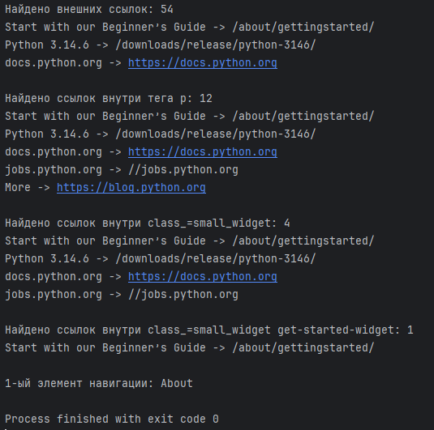
  <br>
  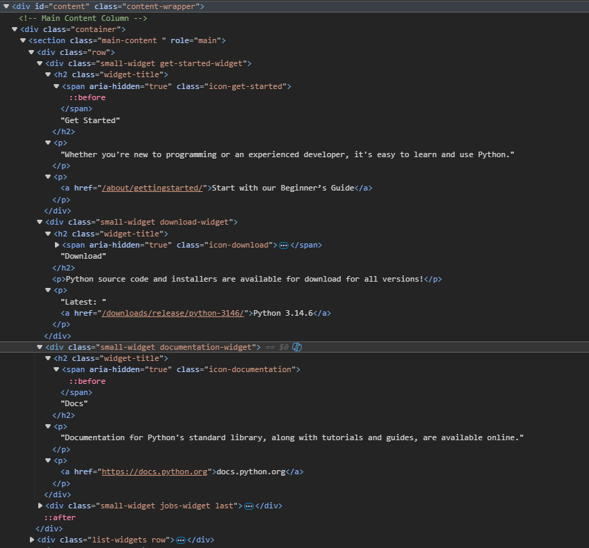
</details>

<br>

4) Извлечение текста и атрибутов.

* `.text` = извлекает текст из объекта.

* `.get_text()` = одно и то же, что и `.text`, только более гибкий. Например, аргумент `strip` со значением `True` (удаляет "", пробелы по краям).

* `.string` = извлекает текст, если содержит только 1 дочернй элемент. Если несколько, то return None.

* `.get('название атрибута')` = извлекает значение атрибута.

* `.attrs` = словарь всех атрибутов элемента.

```
import requests
from bs4 import BeautifulSoup

url = "https://www.python.org"
response = requests.get(url)
soup = BeautifulSoup(response.text, 'lxml')

# Извлечение текста из заголовка
title_tag = soup.find('title')
if title_tag:
    print(f"Текст заголовка (text): {title_tag.text}")
    print(f"Текст заголовка (string): {title_tag.string}")

# Извлечение атрибута из заголовка
link = soup.find('a')
if link:
    print(f"Первая ссылка: {link.text.strip()}")
    print(f"Атрибут href: {link.get('href')}")
    print(f"Все атрибуты: {link.attrs}")
```

<details>
  <summary>select(), select_one()</summary>
  <br>
  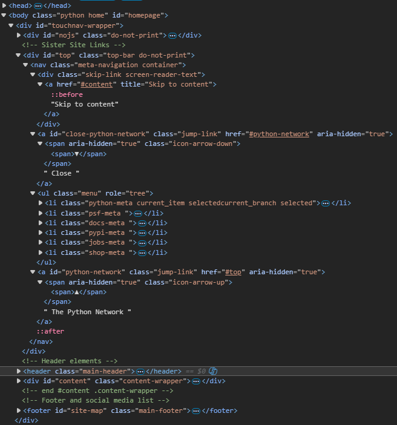
  <br>
  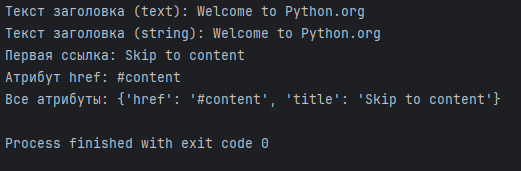
</details>

<br>

5) Навигация по дереву `HTML`.

bs4 позволяет перемещаться по дереву `HTML`, используя отношения между элементами (родитель, потомок, сосед).

* `.parent` = родитель элемента.

* `.children` = потомки элемента.

* `.next_sibling`, `.previous_sibling` = соседние элементы на том же уровне.

* `.find_next_sibling()`, `.find_previous_sibling()` = методы поиска соседних элементов.

<br>
<br>

---

## <a id="title3">Работа с REST API и форматом JSON</a>

1) Сериализация и десериализация `Python`/`JSON`.

* `json.dumps()` = сериализует `Python-объект` в `JSON-строку`.

* `json.loads()` = десериализует `JSON-строку` в `Python-объект`.

* `indent=2` = добавляет отступы, более читаемый.

* `ensure_ascii=False` = корректно отображать кириллицу (не `ASCII` символ).

```
import json

data = {
    "name": "Боби",
    "age": 25,
    "city": "Oslo",
    "hobbies": ["reading", "hiking"]
}

# Сериализация
json_string = json.dumps(data, indent=2, ensure_ascii=False)
print(f"JSON:\n")
print(json_string)

# Десериализация
parser_data = json.loads(json_string)
print(f"\nPython:\n")
print(parser_data)
print(f"Name: {parser_data['name']}")
print(f"First hobby: {parser_data['hobbies']}")
```

<details>
  <summary>json/python</summary>
  <br>
  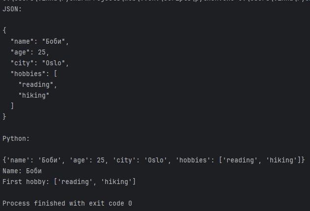
</details>

2) Получение данных из публичного `API`.

* `response.json()` = автоматически парсит `json-ответ` в `python-словарь`.

```
import requests

url_users = "https://jsonplaceholder.typicode.com/users"

# Получение списка всех пользователей
user_response = requests.get(url_users)
user_response.raise_for_status()
users = user_response.json()
print(f"Первые 3 пользователя:\n")
for user in users[:3]:
    print(f"id: {user['id']}, имя: {user['name']}")

# Получение информации о 1-м пользователе
user_url = "https://jsonplaceholder.typicode.com/users/1"
user_response = requests.get(user_url)
user_response.raise_for_status()
user_first = user_response.json()
print(f"\nПервый пользователь: id = {user_first['id']}, name = {user_first['name']}, address-city = {user_first['address']['city']}\n")
```

<details>
  <summary>JSONPlaceHolder</summary>
  <br>
  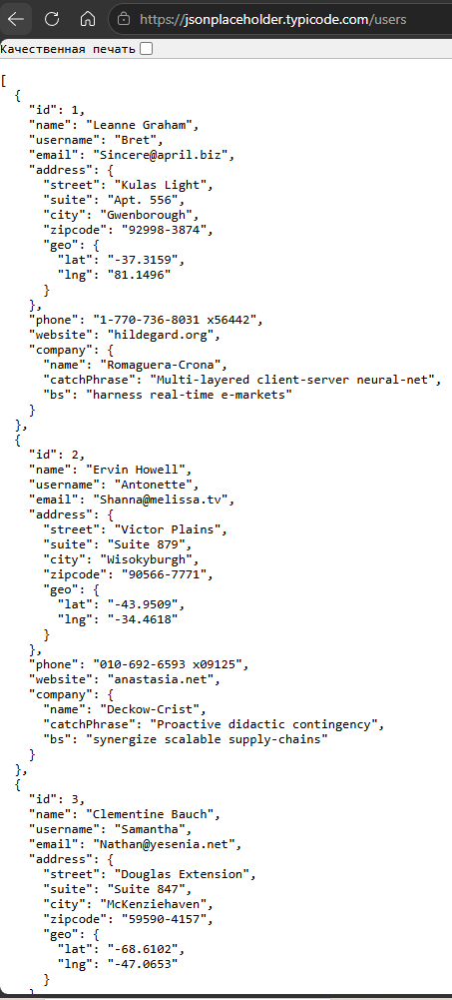
  <br>
  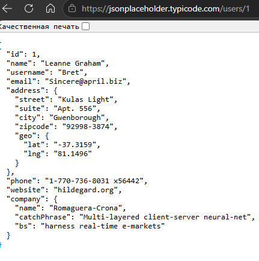
</details>

3) Получение данных из публичного `API` с обработкой ошибок.

* `hasattr(req_err,'reponse')` = существует ли в объекте данное поле.

```
import requests
from requests import RequestException
import json


def get_user_data(user_id):
    url_user = f"https://jsonplaceholder.typicode.com/users/{user_id}"
    try:
        response = requests.get(url_user)
        response.raise_for_status()
        return response.json()
    except RequestException as req_err:
        print(f"Ошибка при запросе данных пользователя c id={user_id}")
        if hasattr(req_err, 'response') and req_err.response is not None:
            print(f"Статус-код:{req_err.response.status_code}")
            try:
                error_details = req_err.response.json()
                print(f"Детали ошибки: {error_details}")
            except json.JSONDecodeError:
                print(f"Ошибка парсинга JSON для пользователя {user_id}. Ответ: {req_err.response.text}")
        return None
    except json.JSONDecodeError:
        print(f"Ошибка парсинга пользователя {user_id}")
        return None


user_1 = get_user_data(1)
if user_1:
    print(f"Данные пользователя {user_1}")

user_999 = get_user_data(999)
if user_999 is None:
    print("Данные пользователя не получены")
```

<details>
  <summary>JSONPlaceHolder</summary>
  <br>
  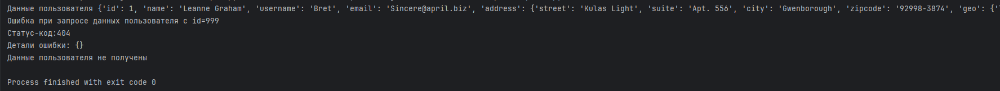
</details>

